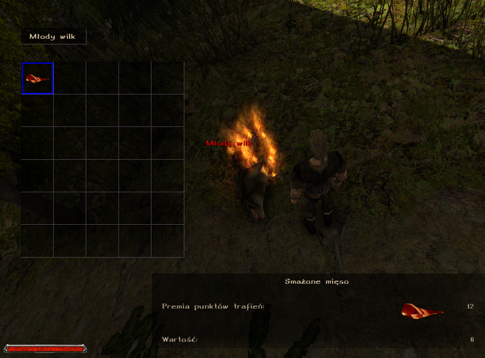

# FriedMeat - Union Plugin [Gothic I/G1A/G2/G2NotR]



FriedMeat is a Union plugin for Gothic I/G1A/G2/G2NotR that turns raw meat into fried meat when a monster burns after taking fire damage. The plugin detects fire effects so it works with all fire damage sources including fire spells, Uriziel sword in Gothic 1 and fire attacks from other NPCs.

## Features

- **Automatic Meat Cooking**: Raw meat in creature inventories is automatically converted to cooked meat when a monster burns after taking fire damage
- **Smart NPC Filtering**: Only affects non-human NPCs (animals and monsters), leaving human NPCs unaffected
- **JSON Configuration**: Easily configurable meat pairs through JSON file supporting multiple mods
- **Multi-Game Support**: Compatible with Gothic I Classic, Gothic I Addon, Gothic II Classic, Gothic II NotR, and popular mods
- **Union Menu Integration**: Enable/disable plugin and access project page directly from Union settings

## Installation

1. Download the latest release from the [Releases](../../releases) page
2. Extract `FriedMeat.vdf` to your `[Gothic]\Data\Plugins` folder
3. Launch Gothic - the plugin will load automatically

## Usage

### Basic Mechanics
- **Fire Damage Detection**: Plugin monitors all damage dealt to NPCs and detects fire-based effects
- **Instant Conversion**: When a fire effect is detected, the NPC is marked for meat conversion
- **Death Processing**: Upon NPC death, all raw meat in their inventory is converted to cooked meat
- **Human Protection**: Human NPCs are excluded from meat conversion to prevent unintended effects

## Configuration

### Through Union Menu (Recommended)

1. Launch the game
2. Go to Main Menu → Options → Union
3. Find "FriedMeat" in the list
4. Toggle the plugin on/off and access the project page

### Through JSON Configuration File

The plugin uses `SYSTEM/FriedMeat.json` to define meat conversion pairs:

```json
{
    "classic": [
        { "raw": "ITFOMUTTONRAW", "cooked": "ITFOMUTTON" }
    ],
    "archolos": [
        { "raw": "ITFO_MOLERATMEAT_RAW", "cooked": "ITFO_MOLERATMEAT" },
        { "raw": "ITFO_TROLLMEAT_RAW", "cooked": "ITFO_TROLLMEAT" },
        { "raw": "ITAT_MEATBUGFLESH", "cooked": "ITAT_MEATBUGFLESH_FRIED" },
        { "raw": "ITAT_RATMEATRAW", "cooked": "ITFO_ROASTEDRATMEAT" },
        { "raw": "ITFO_BEARRAW", "cooked": "ITFO_BEAR" },
        { "raw": "ITFO_BOAR_RAW", "cooked": "ITFO_BOAR" },
        { "raw": "ITFO_CRABRAW", "cooked": "ITFO_CRAB" },
        { "raw": "ITFO_SCAVENGERMEAT_RAW", "cooked": "ITFO_SCAVENGERMEAT" },
        { "raw": "ITFO_SHADOWMEAT_RAW", "cooked": "ITFO_SHADOWMEAT" },
        { "raw": "ITFO_SHEEP_RAW", "cooked": "ITFO_SHEEPFRIED" },
        { "raw": "ITFO_WOLFMEAT_RAW", "cooked": "ITFO_WOLFMEAT" }
    ]
}
```

### Adding Custom Meat Pairs

To add support for new mods or custom meat types:

1. Open `SYSTEM/FriedMeat.json` in a text editor
2. Add a new category or extend existing ones:
```json
{
    "classic": [...],
    "archolos": [...],
    "your_mod": [
        { "raw": "CUSTOM_RAW_MEAT", "cooked": "CUSTOM_COOKED_MEAT" }
    ]
}
```
3. Save the file and restart the game

### Configuration Limits
- **Maximum Meat Pairs**: 128 pairs total across all categories
- **Name Length**: Raw and cooked meat names limited to 63 characters each
- **Categories**: Unlimited number of mod categories supported

## Supported Games and Mods

### Base Games
- **Gothic I Classic**: ✅ Supported
- **Gothic I Addon**: ✅ Supported  
- **Gothic II Classic**: ✅ Supported
- **Gothic II NotR**: ✅ Supported

### Popular Mods
- **The Chronicles Of Myrtana: Archolos**: ✅ Pre-configured with 11 meat pairs
- **Other Mods**: Easily configurable through JSON file if they use different meat instances than classic Gothic

## Building from Source

### Prerequisites
- Visual Studio 2019 or later
- Union SDK v1.0m
- nlohmann/json library (included)

### Build Steps
1. Clone this repository
2. Copy ZenGin folder from Union SDK to `FriedMeat/ZenGin/`
3. Open `FriedMeat.sln` in Visual Studio
4. Select "MP x4 MT Release" configuration
5. Build the solution
6. Find the compiled DLL in the `Bin/` folder

## Credits

### Development
- **Plugin Author** - [Raster96](https://github.com/Raster96/FriedMeat-Union)
- **Union Team** - For the excellent Union SDK framework
- **nlohmann** - For the JSON library
- **Gothic Community** - For continued support and testing

## License

MIT License

## Troubleshooting

### Plugin Not Loading
- Ensure `FriedMeat.vdf` is in the correct folder: `[Gothic]\Data\Plugins`
- Check that Union is properly installed
- Verify Gothic version compatibility
- Check that `SYSTEM/FriedMeat.json` exists and is valid JSON

### Meat Not Converting
- Verify the plugin is enabled in Union menu
- Ensure creatures are dying from fire damage (look for fire visual effects)
- Check that the raw meat names in JSON match your game/mod exactly
- Confirm the creature is not human (plugin only affects animals/monsters)
- **Archolos Note**: Trolls and Molerats don't catch fire from certain spells - hopefully this will be fixed in Archolos 2.0

### JSON Configuration Issues
- Validate JSON syntax using an online JSON validator
- Ensure raw and cooked meat instance names are correct for your game/mod
- Verify total meat pairs don't exceed 128 limit

### Game Crashes
- Ensure you're using the correct plugin version for your Gothic version
- Check that all referenced meat instances exist in your game/mod
- Try reducing the number of meat pairs if experiencing issues

## Contributing

This is a community project. Feel free to:
- Report bugs in the [Issues](../../issues) section
- Submit improvements via Pull Requests
- Share feedback and suggestions
- Add support for new mods by contributing JSON configurations
- Test with different Gothic versions and mods
- Discord: raster96

## Version History

- **v1.0.0** - Initial release
  - Fire damage detection system
  - Automatic meat conversion on death
  - JSON configuration support
  - Multi-game compatibility
  - Union menu integration
  - Human NPC protection

---